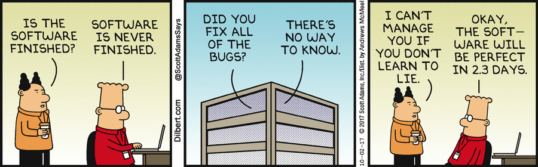

# comics

[GoComics](https://www.gocomics.com/) API wrapper

[](https://pypi.python.org/pypi/comics)
[](https://www.python.org/downloads/)
[](https://github.com/irahorecka/comics/actions)
[](https://raw.githubusercontent.com/irahorecka/comics/main/LICENSE)

## Installation

```bash
pip install comics
```

## Quick start

Find and download the Calvin and Hobbes comic strip published on January 2, 1990:

```python
import comics

ch = comics.search("calvinandhobbes").date("January 2, 1990")
ch.download("calvinandhobbes.png")
```

<div align="center">
    
</div>

## Find comics

Available comics can be found using the `directory` class:

```python
import comics

# List available comics - total of 475
comics.directory.listall()
# >>> ("1-and-done", "9-chickweed-lane-classics", "9chickweedlane", "9to5", ... )

# Find endpoints for Calvin and Hobbes
comics.directory.search("Calvin and Hobbes")
# >>> ("calvinandhobbes", "calvinandhobbesenespanol")
```

First, pass the desired endpoint to `comics.search`. For example, to search for Calvin and Hobbes comics in english use `comics.search("calvinandhobbes")`; for spanish, use `comics.search("calvinandhobbesenespanol")`.

## Search and download comics

Then, search for a comic strip using the `date` or `random_date` method:

```python
import comics

# Get a Calvin and Hobbes comic strip by date
ch = comics.search("calvinandhobbes").date("2013-05-13")  # Also accepts datetime object

# Get a random Calvin and Hobbes comic strip
random_ch = comics.search("calvinandhobbes").random_date()
```

Finally, show, download, or stream the comic strip:

```python
# Show comic strip - opens in default image viewer application
ch.show()

# Download comic strip - defaults to {endpoint}.png if an export path is not provided
# E.g., a Calvin and Hobbes comic strip will be exported as "calvinandhobbes.png" in the current working directory
ch.download()

# Stream comic strip - useful if custom image content manipulation is desired
ch.stream()
```

## Attributes

An instantiated `search` class will have the following public attributes:

```python
import comics

garfield = comics.search("garfield")
garfield.endpoint
# >>> "garfield"
garfield.title
# >>> "Garfield"
garfield.start_date
# >>> "1978-06-19"
```

An instantiated `search` class with `date` or `random_date` will have the following public attributes:

```python
import comics

garfield = comics.search("garfield").date("08/20/2000")
garfield.endpoint
# >>> "garfield"
garfield.title
# >>> "Garfield"
garfield.date
# >>> "2000-08-20"
garfield.url
# >>> "https://www.gocomics.com/garfield/2000/08/20"
garfield.image_url
# >>> "https://assets.amuniversal.com/6694c52099bd01365606005056a9545d"
```

## Exceptions

An exception will be thrown if the queried date is unregistered or before the comic's origin date:

```python
import comics
from comics.exceptions import InvalidDateError

try:
    peanuts = comics.search("peanuts").date("1900-01-01")
    peanuts.download()
except InvalidDateError:
    print("Whoops, an invalid date was queried.")
```

An exception will be thrown if the queried endpoint is unregistered:

```python
import comics
from comics.exceptions import InvalidEndpointError

try:
    invalid_comic = comics.search("invalid_endpoint").date("2000-01-01")
    invalid_comic.download()
except InvalidEndpointError:
    print("Whoops, an invalid endpoint was queried.")
```

## Contribute

* [Issues Tracker](https://github.com/irahorecka/comics/issues)
* [Source Code](https://github.com/irahorecka/comics/tree/main/comics)

## Support

If you are having issues or would like to propose a new feature, please use the [issues tracker](https://github.com/irahorecka/comics/issues).

<div align="center">
    
</div>

## License

This project is licensed under the MIT license.
